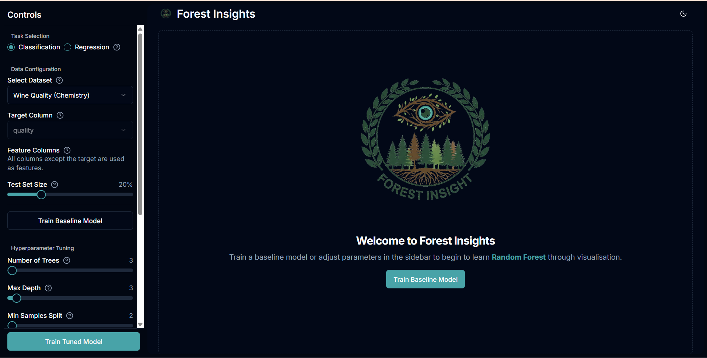
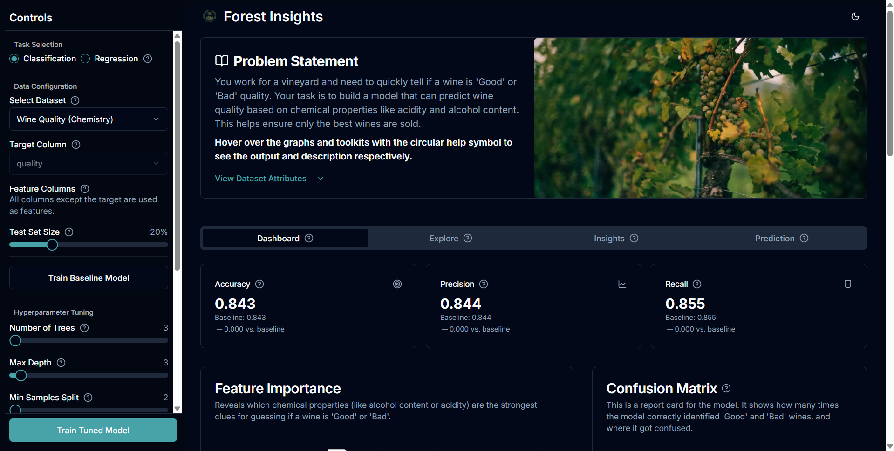

# 🌲 Learn Random Forest Through Visualization  

An interactive and beginner-friendly web app to **learn Random Forest** — one of the most powerful ensemble learning algorithms in Machine Learning — **through visualization**.  

🎯 **Live Demo:**  
👉 [https://forest-insights-git-main-chandan-kumars-projects-dc82feb1.vercel.app](https://forest-insights-git-main-chandan-kumars-projects-dc82feb1.vercel.app)

---

## 🖼️ Project Preview

  
  

---

Built using **Next.js**, **Tailwind CSS**, and **TypeScript**, this project turns complex Random Forest concepts into **intuitive visual explanations**. 🧠📊  

---

## 🧑‍💻 Team Members

| Name | Roll No. | Contributions |
|------|-----------|----------------|
| **Chandan Kumar** | 24BDS013 | Worked on version 1 of the project and gave the direction and ignition. Shaped the foundation for version 2 and contributed inputs to the frontend. Managed GitHub domain tasks in both versions. Framed the idea to summarize training in the view dataset page for all three roles in version 2. |
| **Nitish Naveen** | 24BDS050 | Built the functional second version of the application using the ideas given by Anchal. Implemented Rithika’s idea of tracing the decision tree. Debugged the application while coordinating with Rithika. |
| **Anchal Jaiswal** | 24BDS003 | Conceived and designed the simpler user interface of version 2, including the creation of three roles, storytelling flow, and the complete “Prediction and Explanation” page for all three roles. |
| **Rithika S** | 24BDS067 | Proposed the idea to visualize the decision tree’s working for better understanding. Validated functionality and tested for bugs in the second version. |

---

## 🧰 Tech Stack

| Technology | Purpose |
|-------------|----------|
| **Next.js** | React-based framework for building fast, interactive web apps |
| **TypeScript** | Type-safe code for better maintainability and reliability |
| **Tailwind CSS** | Utility-first CSS framework for sleek, responsive UI |
| **Recharts / D3.js (optional)** | For creating dynamic visualizations |
| **Vercel** | (Optional) For deployment and hosting |

---

## 🚀 Features

- 🌳 **Visualize Decision Trees and Random Forests**  
- 📈 **Interactive plots** for understanding data splits and predictions  
- 🎨 **Modern responsive UI** built with Tailwind CSS  
- 🧩 **TypeScript-powered components** for clarity and scalability  
- 🧠 Ideal for **students, beginners**, and **visual learners**

---

## 🎯 Learning Goals

By exploring this project, you’ll:
- Understand how **Decision Trees** split data  
- Learn how **Random Forest** combines multiple trees for better accuracy  
- Visualize how data points are classified in each tree  
- See **feature importance** and **voting behavior** in action  
- Get a clear, intuitive grasp of how ensemble models work  

---

## 🧩 Project Structure

Forest-Insights/
│
├── .git/                    # Git version control data
├── .idx/                    # Internal build/indexing folder
├── .next/                   # Next.js build output (ignored in .gitignore)
├── docs/                    # Documentation or related resources
├── node_modules/            # Installed dependencies (ignored in .gitignore)
│
├── public/                  # Static assets (images, icons, etc.)
├── src/                     # Main application source code
│
├── .env                     # Environment variables (ignored in .gitignore)
├── .gitignore               # Files and folders ignored by Git
├── .modified                # Custom project marker/config file
├── apphosting.yaml          # Hosting configuration (Firebase / App Hosting)
├── components.json          # Component configuration file
│
├── next-env.d.ts            # Next.js TypeScript environment definitions
├── next.config.ts           # Next.js configuration
│
├── package.json             # Project dependencies and scripts
├── package-lock.json        # Locked dependency versions
├── postcss.config.mjs       # PostCSS configuration
│
├── README.md                # Project documentation (this file)
├── sample.env               # Example environment variables file
│
├── tailwind.config.ts       # Tailwind CSS configuration
└── tsconfig.json            # TypeScript configuration

---

⚙️ Installation & Setup
Clone the repository

git clone https://github.com/chandank013/random-forest-visualization.git
cd Forest-Insight
Install dependencies

---

npm install
Run the development server

npm run dev
Open in browser
http://localhost:9002

---

🌐 Live Deployment
You can view the live deployed app here:
🔗 https://forest-insights-git-main-chandan-kumars-projects-dc82feb1.vercel.app

---

💡 Author
Team Forest-Insights
Built with ❤️ using Next.js, TypeScript, and Tailwind CSS.

---

